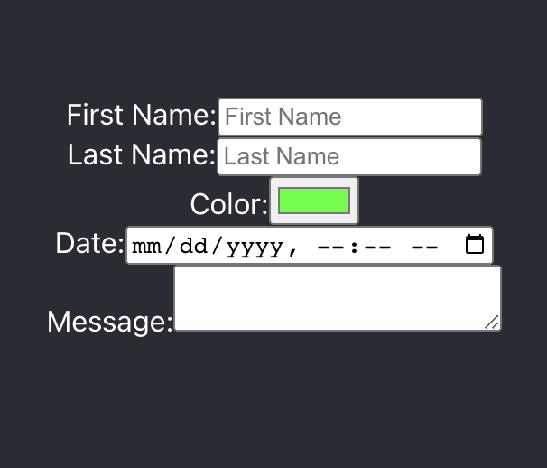

# Form Practice - React.js App

Building a React app with onchange functionality fro an HTML form for BocaCode C-10 in class practice.

## Covered In Class
* onChange
* Form Elements
* Controlled Components

## Basic Code
            <label>First Name:
            <input type="text" value={firstName}
                placeholder="First Name"
                onChange={handleUpdate}/>
            </label>

